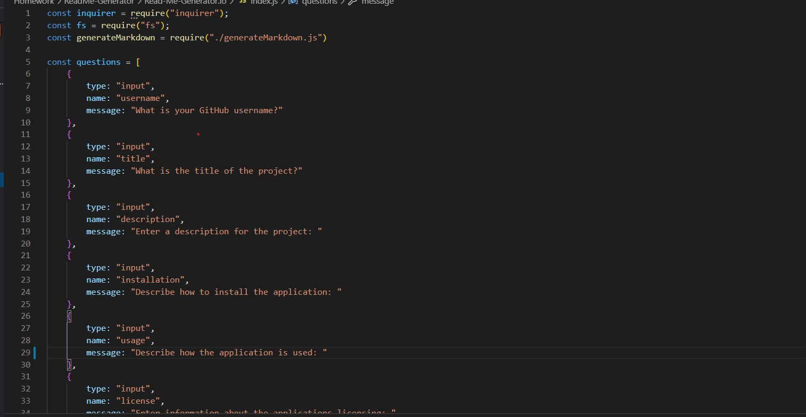

# Read-Me-Generator.io

## Description

A command-line application that will allow for quick and easy generation of a project README to get started quickly. This will allow a project creator to spend more time working on finishing the project and less time creating a good README.

## Table of Contents

[Installation](#installation)
[Usage](#usage)
[License](#license)
[Contributing](#contributing)
[Testing](#testing)

## Installation

## Usage

![demo]

## License

* ISC

## Tests

* Jest

